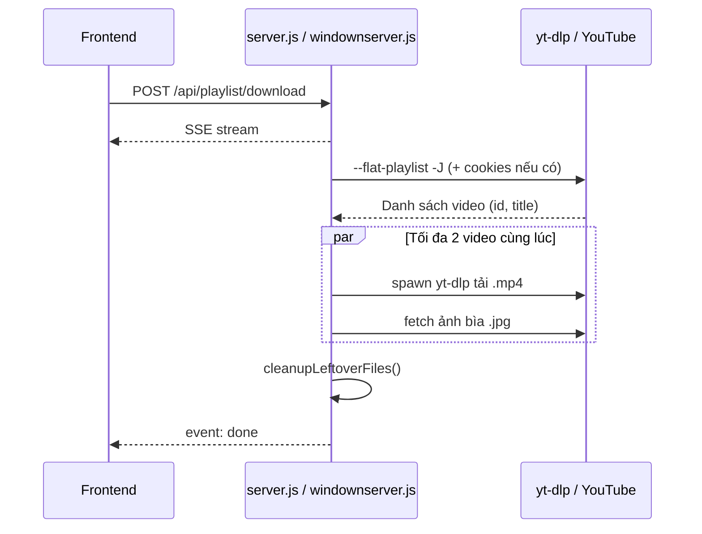

# ToolDownload

Công cụ tải hàng loạt video từ **YouTube Playlist** qua giao diện web. Backend dùng **Node.js + Express**, gọi **yt-dlp** để tải video và ảnh bìa, trả tiến trình real-time qua **Server-Sent Events (SSE)**.

---

## Tính năng

- Tải video theo khoảng vị trí trong playlist (từ video thứ X đến Y)
- Chọn độ phân giải: **480p** (mặc định), **720p**, **1080p**
- **480p thật** — tải video + audio riêng rồi gộp `.mp4` (cần ffmpeg)
- Tải **2 video song song** (cấu hình được qua `.env`)
- Tải **ảnh bìa song song** với video
- Hỗ trợ **cookies YouTube** cho playlist >100 video
- Log yt-dlp gọn (mốc 25/50/75/100%)
- Cho phép chọn **thư mục lưu** tùy ý
- Hiển thị log terminal và **progress bar** trên giao diện
- Tự dọn file tạm (`.webm`, `.part`, ...) sau khi tải xong

---

## Yêu cầu hệ thống

| Thành phần | macOS / Linux | Windows |
|---|---|---|
| Node.js 18+ | ✅ | ✅ |
| yt-dlp | Trên PATH | `yt-dlp.exe` trong thư mục project |
| ffmpeg | Khuyến nghị (bắt buộc cho 480p merge) | **Bắt buộc** |
| Trình duyệt | Chrome / Firefox / Safari | Chrome / Edge |

Kiểm tra nhanh:

```bash
node -v
yt-dlp --version    # hoặc .\yt-dlp.exe --version trên Windows
ffmpeg -version
```

---

## Cài đặt & chạy

### macOS / Linux

```bash
cd ToolDownload
npm install
cp .env.example .env   # tùy chọn
npm start              # chạy server.js
```

Mở trình duyệt: **http://localhost:3000**

### Windows

- **Client mới (tóm tắt nhanh):** [CLIENT-SETUP.md](./CLIENT-SETUP.md)
- **Hướng dẫn đầy đủ:** [INSTALL-WINDOWS.md](./INSTALL-WINDOWS.md)

**Chạy bằng Node.js (phát triển):**

```powershell
# Cài Node.js + ffmpeg, tải yt-dlp.exe vào thư mục project
cd D:\Tool\yt-playlist-harvester
npm install
copy .env.example .env
npm run start:win      # chạy windownserver.js
```

**Build & chạy file `.exe` (phân phối — không cần Node.js khi chạy):**

```powershell
cd D:\Tool\yt-playlist-harvester
npm install
npm run build:exe      # tạo yt-playlist-harvester.exe
.\yt-playlist-harvester.exe
```

Chi tiết: [INSTALL-WINDOWS.md — Cách 2](./INSTALL-WINDOWS.md#cách-2--build--chạy-file-exe-phân-phối)

> **Lưu ý:** `npm start` chạy `server.js` (Mac/Linux). Trên Windows dùng **`npm run start:win`**.

Mỗi lần sửa code, **dừng server** (`Ctrl+C`) rồi chạy lại.

---

## Cấu trúc dự án

```
ToolDownload/
├── server.js              # Backend macOS/Linux
├── windownserver.js       # Backend Windows
├── ytdlp-cookies.js       # Cookies YouTube
├── download-queue.js      # Tải song song
├── ytdlp-log-filter.js    # Lọc log yt-dlp
├── yt-dlp.exe             # Windows — tự tải, không commit
├── yt-playlist-harvester.exe   # Windows — sau npm run build:exe
├── .env.example           # Mẫu cấu hình
├── package.json
├── public/
│   ├── index.html         # Giao diện (Tailwind CSS, dark mode)
│   └── script.js          # Frontend, API + SSE
├── INSTALL-WINDOWS.md     # Hướng dẫn Windows chi tiết
└── downloads/             # Thư mục mặc định (tự tạo)
```

---

## Hướng dẫn sử dụng (Giao diện)

1. Dán **URL Playlist YouTube** (vd: `https://www.youtube.com/playlist?list=...`)
2. Nhập **Từ video thứ (X)** và **Đến video thứ (Y)** — đếm từ **1**
3. Chọn **độ phân giải** (mặc định 480p)
4. *(Tùy chọn)* Nhập **Thư mục lưu file**
5. Bấm **Bắt đầu tải hàng loạt**
6. Theo dõi log và thanh tiến trình

### Quy tắc đặt tên file

Video #120, tiêu đề *"Anh cần em"*:

```
120.jpg
120 Anh cần em.mp4
```

| Thành phần | Quy tắc |
|---|---|
| Ảnh bìa | `[STT].jpg` — chỉ số thứ tự |
| Video | `[STT] [Tiêu đề].mp4` |
| STT | Vị trí gốc playlist; `01`–`99` pad 2 chữ số, `100+` giữ nguyên |
| Tiêu đề | Từ playlist; ký tự `\ / : * ? " < > \|` bị xóa |

---

## Luồng hoạt động



### Chi tiết từng bước (Backend)

1. **Nhận tham số** — `playlistUrl`, `fromIndex`, `toIndex`, `resolution`, `downloadPath`
2. **Lấy danh sách playlist** — `yt-dlp --flat-playlist -J` (+ cookies, `--playlist-items` nếu >100)
3. **Cắt mảng** — video từ X đến Y
4. **Tải song song** — tối đa `DOWNLOAD_CONCURRENCY` video (mặc định 2)
5. **Mỗi video:** tải `.mp4` và `.jpg` **cùng lúc**
6. **Dọn rác** — xóa file không phải `.mp4` / `.jpg`
7. **Kết thúc** — event `done`

---

## API Reference

### `GET /api/health`

```json
{ "status": "ok", "message": "Server is running" }
```

### `POST /api/playlist/download`

Trả về **SSE stream** (`text/event-stream`).

| Trường | Kiểu | Bắt buộc | Mô tả |
|---|---|---|---|
| `playlistUrl` | string | Có | URL playlist YouTube |
| `fromIndex` | number | Có | Video bắt đầu (≥ 1) |
| `toIndex` | number | Có | Video kết thúc (≥ fromIndex) |
| `resolution` | number | Có | `480`, `720`, `1080` |
| `downloadPath` | string | Không | Thư mục lưu; trống = `./downloads` |

### Sự kiện SSE

| Event | Mô tả |
|---|---|
| `info` | Trạng thái (playlist, cookies, concurrency…) |
| `playlist` | Danh sách video sẽ tải |
| `start` | Bắt đầu 1 video |
| `progress` | Log yt-dlp (đã lọc gọn) |
| `video_done` | Xong file `.mp4` |
| `thumb_done` | Xong ảnh bìa `.jpg` |
| `thumb_error` | Lỗi ảnh bìa (không dừng batch) |
| `item_done` | Hoàn tất 1 video — cập nhật progress bar |
| `cleanup` | Đã xóa file thừa |
| `done` | Hoàn thành toàn bộ |
| `error` | Lỗi nghiêm trọng |

---

## Cấu hình yt-dlp

| Tham số | macOS/Linux | Windows |
|---|---|---|
| Player client | `youtube:player_client=web` | `youtube:player_client=android,tvhtml5` |
| Format | `bestvideo[height<=RES]+bestaudio/best[height<=RES]` | Giống |
| Merge | `--merge-output-format mp4` | Giống |
| Cookies | `--cookies` hoặc `--cookies-from-browser` | Giống |

Format trên đảm bảo **480p thật** (video + audio tách, gộp ffmpeg) — chất lượng tốt hơn 1 file mp4 gộp sẵn (thường chỉ 360p).

---

## Biến môi trường

Copy `.env.example` → `.env`:

| Biến | Mặc định | Mô tả |
|---|---|---|
| `PORT` | `3000` | Cổng server |
| `DOWNLOAD_CONCURRENCY` | `2` | Video tải đồng thời (1–4) |
| `YTDLP_COOKIES_FROM_BROWSER` | — | `edge`, `chrome`, `firefox`… |
| `YTDLP_COOKIES` | `cookies.txt` | File cookies Netscape |

---

## Xử lý sự cố

| Triệu chứng | Cách xử lý |
|---|---|
| `HTTP 404` khi tải | Restart server |
| `Không chạy được yt-dlp` (Win) | Đặt `yt-dlp.exe` vào thư mục project |
| `Không chạy được yt-dlp` (Mac) | Cài yt-dlp trên PATH |
| Chỉ thấy 100 video / lỗi #101+ | Bật cookies trong `.env` |
| File `01 video.mp4` | Thiếu tiêu đề playlist — thử cookies |
| Không merge được `.mp4` | Cài `ffmpeg` |
| `Sleeping 5 seconds` | Hạ `DOWNLOAD_CONCURRENCY=1`, thêm cookies |

Chi tiết Windows: **[INSTALL-WINDOWS.md](./INSTALL-WINDOWS.md)**

---

## Share source code

### Gửi kèm

- Toàn bộ source (trừ `node_modules/`, `downloads/`)
- `.env.example`, `INSTALL-WINDOWS.md`

### Không gửi

- `.env`, `cookies.txt` (thông tin đăng nhập)
- `node_modules/`, video trong `downloads/`

### Người nhận Windows cần tự cài

1. Node.js LTS  
2. ffmpeg  
3. `yt-dlp.exe` → thư mục project  
4. `npm install` → `npm run start:win`

---

## Công nghệ

**Backend:** Express 5, CORS, dotenv, child_process

**Frontend:** HTML, Tailwind CSS (CDN), vanilla JS, Fetch + SSE

**Bên ngoài:** yt-dlp, ffmpeg, YouTube thumbnail CDN

---

## Giấy phép

ISC
