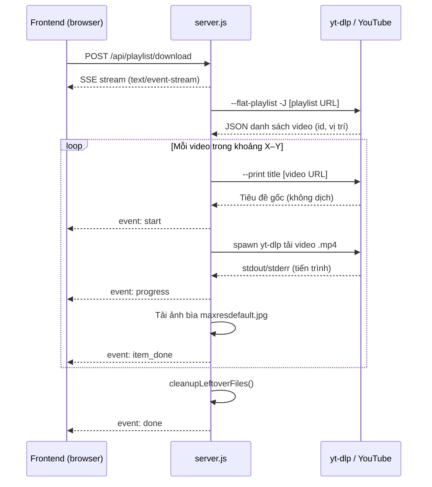

# ToolDownload

Công cụ tải hàng loạt video từ **YouTube Playlist** qua giao diện web. Backend dùng **Node.js + Express**, gọi **yt-dlp** hệ thống để tải video và ảnh bìa, trả tiến trình real-time qua **Server-Sent Events (SSE)**.

---

## Tính năng

- Tải video theo khoảng vị trí trong playlist (từ video thứ X đến Y)
- Chọn độ phân giải: **480p**, **720p**, **1080p**
- Tự đặt tên file theo **số thứ tự gốc** trong playlist + **tiêu đề gốc** (không dịch)
- Tải kèm **ảnh bìa** chất lượng cao (`.jpg`)
- Cho phép chọn **thư mục lưu** tùy ý
- Hiển thị log terminal và **progress bar** trên giao diện
- Tự dọn file tạm (`.webm`, `.part`, ...) sau khi tải xong

---

## Yêu cầu hệ thống

| Thành phần | Phiên bản / Ghi chú |
|---|---|
| Node.js | 18+ (dùng `fetch` native) |
| yt-dlp | Cài trên PATH (`brew install yt-dlp` hoặc `pip install yt-dlp`) |
| ffmpeg | Khuyến nghị — yt-dlp dùng để gộp video + audio thành `.mp4` |

Kiểm tra nhanh:

```bash
node -v
yt-dlp --version
ffmpeg -version   # tùy chọn nhưng nên có
```

---

## Cài đặt & chạy

### macOS / Linux

```bash
# Clone / mở thư mục dự án
cd ToolDownload

# Cài dependencies
npm install

# (Tùy chọn) Tạo file .env
echo "PORT=3000" > .env

# Khởi động server
npm start
```

### Windows

Xem hướng dẫn chi tiết: **[INSTALL-WINDOWS.md](./INSTALL-WINDOWS.md)**

Bao gồm: cài Git, Node.js, yt-dlp, ffmpeg qua `winget`, clone từ GitHub, extension VS Code/Cursor, và xử lý lỗi trên Windows.

Mở trình duyệt: **http://localhost:3000**

> **Lưu ý:** Mỗi lần sửa `server.js`, cần **dừng server cũ** (Ctrl+C) rồi chạy lại `npm start`. Nếu gặp lỗi HTTP 404, thường là do server cũ vẫn đang chạy.

---

## Cấu trúc dự án

```
ToolDownload/
├── server.js           # Backend Express + yt-dlp
├── package.json
├── public/
│   ├── index.html      # Giao diện (Tailwind CSS, dark mode)
│   └── script.js       # Logic frontend, gọi API + SSE
└── downloads/          # Thư mục mặc định (tự tạo)
```

---

## Hướng dẫn sử dụng (Giao diện)

1. Dán **URL Playlist YouTube** (vd: `https://www.youtube.com/playlist?list=...`)
2. Nhập **Từ video thứ (X)** và **Đến video thứ (Y)** — đếm từ **1**, không phải 0
3. Chọn **độ phân giải** (mặc định 480p)
4. *(Tùy chọn)* Nhập **Thư mục lưu file**
   - Để trống → lưu vào `./downloads`
   - Đường dẫn tương đối: `./my-videos`
   - Đường dẫn tuyệt đối: `/Users/name/Videos`
5. Bấm **Bắt đầu tải hàng loạt**
6. Theo dõi log và thanh tiến trình trên màn hình

### Ví dụ đặt tên file

Playlist có video thứ 20 với tiêu đề tiếng Nhật. Tải từ #20 đến #22 sẽ tạo:

```
20 【歴史ミステリー】19世紀に「動物の血を飲む」....mp4
20 【歴史ミステリー】19世紀に「動物の血を飲む」....jpg
21 [Tiêu đề gốc video 21].mp4
21 [Tiêu đề gốc video 21].jpg
22 [Tiêu đề gốc video 22].mp4
22 [Tiêu đề gốc video 22].jpg
```

**Quy tắc đặt tên:** `[STT] [Tiêu đề đã làm sạch].mp4`

- **STT** = vị trí gốc trong playlist, luôn **2 chữ số** (`01`, `20`, `35`)
- Ký tự bị xóa khỏi tiêu đề: `\ / : * ? " < > |`

---

## Luồng hoạt động



### Chi tiết từng bước (Backend)

1. **Nhận tham số** — `playlistUrl`, `fromIndex`, `toIndex`, `resolution`, `downloadPath`
2. **Chuẩn bị thư mục** — resolve đường dẫn, `fs.mkdirSync` nếu chưa tồn tại
3. **Lấy danh sách playlist** — `yt-dlp --flat-playlist -J` (chỉ lấy `id`, không tin tiêu đề từ playlist vì YouTube hay trả bản dịch)
4. **Cắt mảng** — `slice(X - 1, Y)` (X, Y tính từ 1)
5. **Lấy tiêu đề gốc** — với mỗi video: `yt-dlp --print %(title)s` + `youtube:player_client=web`
6. **Tải video** — `spawn('yt-dlp')` với format `bestvideo[height<=RES]+bestaudio/best[height<=RES]`, merge `.mp4`, `--no-keep-video`
7. **Tải ảnh bìa** — `maxresdefault.jpg`, fallback `hqdefault.jpg`
8. **Dọn rác** — xóa file không phải `.mp4` / `.jpg` trong thư mục lưu
9. **Kết thúc** — gửi event `done` và đóng SSE

---

## API Reference

### `GET /api/health`

Kiểm tra server có đang chạy.

**Response:**
```json
{ "status": "ok", "message": "Server is running" }
```

---

### `POST /api/playlist/download`

Bắt đầu tải playlist. Trả về **SSE stream** (không phải JSON thông thường).

**Request body:**

| Trường | Kiểu | Bắt buộc | Mô tả |
|---|---|---|---|
| `playlistUrl` | string | Có | URL playlist YouTube |
| `fromIndex` | number | Có | Video bắt đầu (≥ 1) |
| `toIndex` | number | Có | Video kết thúc (≥ fromIndex) |
| `resolution` | number | Có | Chiều cao tối đa: `480`, `720`, `1080` |
| `downloadPath` | string | Không | Thư mục lưu; trống = `./downloads` |

**Ví dụ:**
```json
{
  "playlistUrl": "https://www.youtube.com/playlist?list=PLxxxx",
  "fromIndex": 1,
  "toIndex": 5,
  "resolution": 480,
  "downloadPath": "./downloads"
}
```

**Lỗi validation (HTTP 400, JSON):**
```json
{ "error": "fromIndex và toIndex không hợp lệ (X >= 1, Y >= X)" }
```

---

## Sự kiện SSE

Mỗi event có dạng:
```
event: <tên>
data: {"message": "...", ...}
```

| Event | Mô tả |
|---|---|
| `info` | Thông báo trạng thái (đang lấy playlist, thư mục lưu, ...) |
| `playlist` | Danh sách video sẽ tải (`selected`, `videos[]`) |
| `start` | Bắt đầu tải 1 video (`stt`, `title`, `videoId`) |
| `progress` | Dòng log từ yt-dlp (phần trăm, tốc độ, ...) |
| `video_done` | Tải xong file `.mp4` |
| `thumb_done` | Tải xong ảnh bìa `.jpg` |
| `thumb_error` | Lỗi ảnh bìa (không dừng toàn bộ) |
| `item_done` | Hoàn tất 1 video — dùng để cập nhật progress bar |
| `cleanup` | Đã xóa file thừa |
| `done` | Hoàn thành toàn bộ (`results`, `downloadDir`) |
| `error` | Lỗi nghiêm trọng |

---

## Cấu hình yt-dlp

Tool luôn truyền các tham số sau:

| Tham số | Mục đích |
|---|---|
| `--extractor-args youtube:player_client=web` | Giữ metadata gốc, hạn chế dịch tiêu đề |
| `--merge-output-format mp4` | Đầu ra chuẩn `.mp4` |
| `--no-keep-video` | Xóa file video/audio tạm sau khi merge |
| `--no-overwrites` | Không ghi đè file đã tồn tại |
| `--newline` | Log tiến trình từng dòng (phục vụ SSE) |

**Format chọn chất lượng:**
```
bestvideo[height<=RES]+bestaudio/best[height<=RES]
```

---

## Biến môi trường

| Biến | Mặc định | Mô tả |
|---|---|---|
| `PORT` | `3000` | Cổng server Express |

Tạo file `.env` ở thư mục gốc:
```
PORT=3000
```

---

## Xử lý sự cố

| Triệu chứng | Nguyên nhân / Cách xử lý |
|---|---|
| `HTTP 404` khi tải | Server cũ chưa restart — chạy lại `npm start` |
| Tiêu đề file bị dịch sang tiếng Anh | Đã xử lý: tool lấy tiêu đề từng video riêng, không dùng tiêu đề từ `--flat-playlist` playlist |
| Còn file `.webm` / `.part` | Tool tự dọn sau mỗi lần tải; nếu tải bị ngắt giữa chừng có thể còn sót |
| `Không chạy được yt-dlp` | Cài yt-dlp và đảm bảo có trong PATH |
| Video không merge được | Cài `ffmpeg` |
| Playlist trống | Kiểm tra URL, playlist public, hoặc thử cập nhật yt-dlp |

---

## Công nghệ sử dụng

**Backend:** Express 5, CORS, dotenv, child_process (execFile/spawn)

**Frontend:** HTML, Tailwind CSS (CDN), vanilla JavaScript, Fetch API + SSE parser

**Bên ngoài:** yt-dlp, ffmpeg (merge), YouTube thumbnail CDN

---

## Giấy phép

ISC
